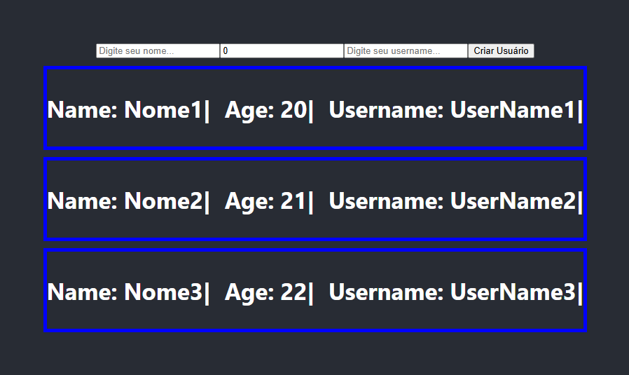

# node_mongo_react_1
Projeto Usando a Stack MERN ( Mongo, Express, React JS, Node JS )

# Projeto Full-Stack com Node.js, MongoDB Atlas e React.js

Este é um projeto full-stack desenvolvido com **Node.js** no backend, **MongoDB Atlas** como banco de dados e **React.js** no frontend. A aplicação foi estruturada de maneira que o backend e o frontend rodam em servidores separados, na mesma máquina, usando portas diferentes.

## Imagem do Projeto

Abaixo, uma captura de tela mostrando a aplicação rodando:



## Tecnologias Utilizadas

- **Backend**: Node.js
- **Banco de Dados**: MongoDB Atlas (com conexão configurada via variável de ambiente)
- **Frontend**: React.js
- **Variáveis de Ambiente**: dotenv (para configurar a string de conexão com o banco de dados)
- **Controle de versão**: gitignore (para evitar o envio da string de conexão para o GitHub)

## Pré-requisitos

Antes de rodar a aplicação, é necessário ter as seguintes ferramentas instaladas no seu ambiente local:

- [Node.js](https://nodejs.org/) (versão 16 ou superior)
- [MongoDB Atlas](https://www.mongodb.com/cloud/atlas) ou instância local do MongoDB
- [npm](https://www.npmjs.com/) (gerenciador de pacotes do Node.js)
- [Git](https://git-scm.com/) (opcional, para controle de versão)

## Configuração do Projeto

### 1. Clone o repositório

Clone este repositório em sua máquina local:

```bash
git clone https://github.com/seu-usuario/seu-repositorio.git

```
### Start the app BackEnd

```shell
npm install 
npm run dev
```

### Start the app FrontEnd

```shell
npm install 
npm start
```